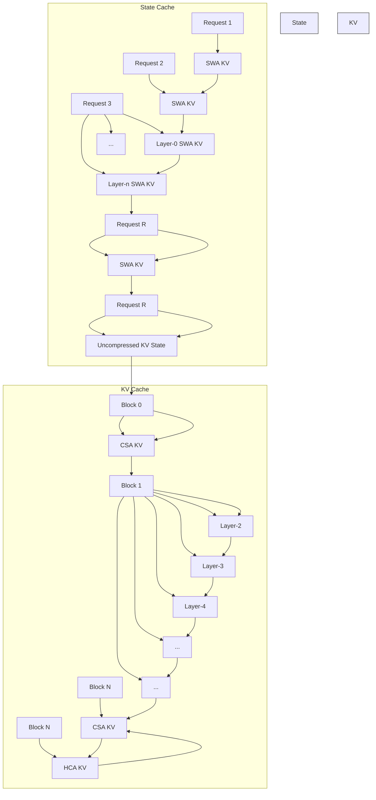

# 260425 - DeepSeek V4：从参数崇拜，转向百万上下文的成本战争

# AI 总结

file name: [DeepSeek V4: 从参数崇拜，转向百万上下文的成本战争] and tone: [positive]

● 转型至技术商业化，V4 提出“百万上下文普惠”理念，专注在大模型商业分层和成本优化。  
● 发布两档次模型 V4-Pro/V4-Flash，细分高性能 vs 成本敏感市场，有效适配不同任务需求。  
创新注意力机制、专家并行调度及 KV cache 优化，显著降低长上下文的计算和服务成本。  
● 国产算力初步适配华为昇腾芯片，推动 AI 成本自主化与模型商业可持续发展。  
● 从模型对比榜单转向产业链竞争，整合模型能力、API 定价、智能体应用与算力供给。

No specific stock recommendations or notable additional technology trends not already mentioned.

# 要点

4 月 24 日，DeepSeek-V4 预览版上线并同步开源，官方给出的关键词是“百万上下文普惠时代”；几乎同一时间，外媒报道称，DeepSeek 正在与外部投资方接触，讨论首次外部融资，募资目标至少 3 亿美元，潜在投资方包括阿里、腾讯和顺为资本，估值区间据称在 100 亿至 300 亿美元之间。

这个时间点很微妙：过去，梁文锋一直以“拒绝资本干预技术判断”作为 DeepSeek 的特殊标签；现在，V4 发布与外部融资信号同时出现，说明 DeepSeek 的叙事正在从“技术理想主义”转向“技术商业化”。V4的真正增量，不是参数更大，也不是某个榜单更好看，而是 DeepSeek 试图把百万上下文、智能体、推理能力和国产算力适配，做成一套可以收费、可以扩张、可以承接资本预期的商业产品。

# 专家观点

# 引言

4 月 24 日，DeepSeek-V4 预览版上线并同步开源，官方给出的关键词是“百万上下文普惠时代”；几乎同一时间，外媒报道称，DeepSeek 正在与外部投资方接触，讨论首次外部融资，募资目标至少 3 亿美元，潜在投资方包括阿里、腾讯和顺为资本，估值区间据称在 100 亿至 300 亿美元之间。

这个时间点很微妙：过去，梁文锋一直以“拒绝资本干预技术判断”作为 DeepSeek 的特殊标签；现在，V4 发布与外部融资信号同时出现，说明 DeepSeek 的叙事正在从“技术理想主义”转向“技术商业化”。V4的真正增量，不是参数更大，也不是某个榜单更好看，而是 DeepSeek 试图把百万上下文、智能体、推理能力和国产算力适配，做成一套可以收费、可以扩张、可以承接资本预期的商业产品。

# 01 V4 的第一层变化：DeepSeek 不再只发模型，而是在搭建一套分层收费的产品体系

过去很多大模型发布，核心叙事是“最强模型又变强了”。它们通常先讲参数、训练数据、榜单分数，再讲开发者如何调用。DeepSeek V4 的不同之处在于，它一开始就把模型拆成了两个价格带：V4-Pro 负责复杂任务，V4-Flash 负责高频调用。前者负责高性能任务，后者负责低成本、高频调用。这说明DeepSeek 不只是想证明自己能做出强模型，而是要把模型能力拆成不同价格、不同成本、不同使用场景的产品层级。

图：DeepSeek-V4-Pro / DeepSeek-V4-Flash 规格对比图

<table><tr><td>模型</td><td>参数</td><td>激活</td><td>预训练数据</td><td>上下文长度</td><td>开源</td><td>API 服务</td><td>网页端/APP访问方式</td></tr><tr><td>deepseek - v4 - pro</td><td>1.6T</td><td>49B</td><td>33T</td><td>1M</td><td>√</td><td>√</td><td>专家模式</td></tr><tr><td>deepseek - v4 - flash</td><td>284B</td><td>13B</td><td>32T</td><td>1M</td><td>√</td><td>√</td><td>快速模式</td></tr></table>

数据来源：DeepSeek 官方发布页，v4-spec.png

上图最值得关注的不是“1.6T 参数”本身，而是 Pro 与 Flash 的分层方式。V4-Pro 总参数为 1.6T，激活参数为 49B，预训练数据为 33T tokens；V4-Flash 总参数为 284B，激活参数为 13B，预训练数据为 32Ttokens。二者都支持 1M 上下文。Hugging Face 模型卡也确认，V4 系列包含 V4-Pro 与 V4-Flash 两个MoE 模型，均支持百万 token 上下文。

大模型已经不只是比谁更强，而是开始比谁能在不同场景里给出更合适的成本。 Pro 不是为了所有用户准备的，它面向复杂代码、长链路智能体、困难推理、复杂知识检索和高价值企业任务；Flash 也不是Pro 的缩水版，而是承担另一类任务：更便宜、更快、更适合规模化 API 调用。

这恰恰是企业使用大模型时最真实的成本结构。企业不会每一次调用都使用最强模型，因为绝大部分任务并不需要最高推理能力。客服、摘要、轻量检索、格式化写作、常规办公自动化，更需要便宜、稳定和吞吐；代码修复、投研分析、复杂文档审阅、多步智能体执行，才需要更强的模型能力。V4 的产品结构，实际上把这种需求分层直接放进了发布体系中。

图：DeepSeek V4 API 模型与价格表

<table><tr><td>API 访问模型名</td><td>输入(缓存命中)</td><td>输入(缓存未命中)</td><td>输出</td><td>上下文长度</td></tr><tr><td>deepseek - v4 - pro</td><td>1 元</td><td>12 元</td><td>24 元</td><td rowspan="2">1M</td></tr><tr><td>deepseek - v4 - flash</td><td>0.2 元</td><td>1 元</td><td>2 元</td></tr></table>

数据来源：DeepSeek API Docs，模型 & 价格页面

上图比模型参数更关键。DeepSeek 官方价格页显示，V4-Flash 与 V4-Pro 都支持 1M 上下文和最大 384K输出，但两者价格差异显著：V4-Flash 的输入缓存命中价格为 0.2 元/百万 tokens，缓存未命中为 1 元，输出为 2 元；V4-Pro 分别为 1 元、12 元、24 元。

V4 的商业化设计不是“一个模型卖所有场景”，而是让开发者在不同任务之间切换成本档位。轻任务用Flash，重任务用 Pro；简单问答用非思考模式，复杂智能体任务用思考模式；重复上下文通过缓存降低输入成本。这套机制很像云计算早期从“服务器性能”走向“实例规格”的过程：真正成熟的产业，不会只卖最强性能，而会卖可选择的性能、可预测的成本和可复制的部署方式。

因此，V4 的第一层边际变化，是 DeepSeek 把大模型从技术展示进一步推向商业分层。过去，用户关心的是“这个模型强不强”；现在，企业更关心的是“这个模型在什么任务上最划算”。当模型被明确拆成Pro 和 Flash 两档，长上下文也被放进 API 价格表里，百万上下文就不再只是能力标签，而开始成为可计量、可调度、可优化的生产资料。

# 02 V4 的第二层变化：真正的技术核心不是百万上下文，而是让百万上下文变得更便宜

如果只看“1M 上下文”，V4 并不只是把窗口拉长。长上下文能力本身并不是终点，因为任何企业在部署时都会遇到更现实的问题：上下文越长，推理越贵，延迟越高，KV 缓存越重，服务吞吐越容易受限。模型能不能读入100 万 token 是一个问题；能不能以足够低的成本、足够稳定的吞吐在生产环境中持续服务，是另一个更关键的问题。

DeepSeek V4 的技术重点，正落在第二个问题上。官方发布页称，V4 开创了新的注意力机制，在 token维度进行压缩，并结合 DSA 稀疏注意力，以降低长上下文对计算和显存的需求；官方还明确表示，从V4 开始，1M 上下文将成为 DeepSeek 官方服务的标配。

图：DeepSeek-V4 与 DeepSeek-V3.2 的单 token 计算量和 KV 缓存对比

line

| Token 位置 (千) | DeepSeek-V3.2 | DeepSeek-V4-Pro | DeepSeek-V4-Flash |
| --------------- | ------------- | --------------- | ----------------- |
| 0               | 0.1           | 0.1             | 0.0               |
| 256             | 0.4           | 0.15            | 0.05              |
| 512             | 0.7           | 0.2             | 0.1               |
| 768             | 1.0           | 0.25            | 0.15              |
| 1024            | 1.2           | 0.3             | 0.2               |

line

| 序列长度 (千) | DeepSeek-V3.2 | DeepSeek-V4-Pro | DeepSeek-V4-Flash |
| -------------- | ------------- | --------------- | ----------------- |
| 0              | 0             | 0               | 0                 |
| 256            | 10            | 1               | 0.5               |
| 512            | 20            | 2               | 1                 |
| 768            | 30            | 3               | 1.5               |
| 1024           | 50            | 5               | 2                 |

数据来源：DeepSeek 官方发布页，v4-efficiency.png

上图=展示的不是简单性能提升，而是成本曲线的变化。DeepSeek 模型卡写到，在 1M-token 上下文设置下，V4-Pro 的单 token 推理 FLOPs 只相当于 V3.2 的 27%，KV cache 只相当于 V3.2 的 10%。这组数据要放在产业语境里理解。大模型过去的竞争逻辑是“扩大参数、扩大数据、扩大算力”；但当模型进入企业应用，尤其进入长文档、代码仓库、企业知识库和智能体任务时，问题就变成了“每一次调用的边际成本”。百万上下文如果只能在高价场景里偶尔使用，它只是技术展示；如果能被稳定压低成本，它才会变成基础设施。

V4 的注意力机制可以通俗理解为三步：

第一，把过长的文本先压缩成更紧凑的信息表示，避免模型在每个 token 上都做同等密度的计算。

第二，在压缩之后再选择真正相关的信息，而不是对全部上下文做全量注意力。

第三，用不同压缩强度的注意力模块配合，既保留局部细节，又降低全局成本。

这样一来，模型并不是“机械地记住所有内容”，而是在长上下文中建立一种更经济的信息检索和调用机制。它不是单点发明，而是 DeepSeek 既有路线的延续：MoE 解决激活参数成本，MTP 提高生成效率，DSA 降低长上下文注意力成本，V4 的混合注意力架构则进一步把长上下文成本曲线压低。表面上看，这是模型结构创新；从商业角度看，这是“服务价格下降”的技术前提。

更重要的是，长上下文不是孤立能力，它会改变应用形态。过去模型处理的是短对话、短文档、局部任务；当上下文长度进入百万级，模型理论上可以处理完整项目资料、企业内部知识库、长周期会议记录、代码仓库、法务文本和投研资料包。但前提是，这类任务不能贵到只有少数高端客户偶尔使用。V4 的技术价值，不在于告诉行业“我能放进更多文本”，而在于告诉行业“我有可能以更低成本持续处理更多文本”。

这是“百万上下文普惠时代”的实质。普惠不是一个宣传词，它背后必须有计算量下降、缓存成本下降、服务吞吐提升和 API 价格下降。没有这些条件，长上下文只能停留在论文和榜单；有了这些条件，长上下文才可能进入生产流程。

因此，V4 的第二层边际变化，是把大模型竞争从“能力上限”推进到“成本下限”。过去行业看谁能做更强模型，下一阶段更关键的问题是：谁能把强模型做得足够便宜。当模型能力逐步逼近时，成本曲线就会成为新的护城河。

# 03 V4 的第三层变化：效率不是一句架构口号，而是从模型训练到推理服务的系统工程

这种效率究竟来自哪里？它并不是单一注意力机制带来的结果，也不是单纯把参数做大或做小，而是模型结构、专家并行、缓存组织和服务调度共同作用的结果。

图：DeepSeek-V3.2-Base、DeepSeek-V4-Flash-Base、DeepSeek-V4-Pro-Base 基础能力对比  
Table1|Comparison among DeepSeek-V3.2-Base,DeepSeek-V4-Flash-Base,and DeepSeek-V4 Pro-Base.All models are evaluated in our internal framework and share the same evaluatio setting.Scores with a gap not exceeding 0.3are considered tobeat the samelevel.The highes score ineach rowisin bold font,and the second isunderlined. 

<table><tr><td></td><td>Benchmark (Metric)</td><td># Shots</td><td>DeepSeek-V3.2 Base</td><td>DeepSeek-V4-Flash Base</td><td>DeepSeek-V4-Pro Base</td></tr><tr><td rowspan="3"></td><td>Architecture</td><td>-</td><td>MoE</td><td>MoE</td><td>MoE</td></tr><tr><td># Activated Params</td><td>-</td><td>37B</td><td>13B</td><td>49B</td></tr><tr><td># Total Params</td><td>-</td><td>671B</td><td>284B</td><td>1.6T</td></tr><tr><td rowspan="12">World Knowl.</td><td>AGIEval (EM)</td><td>0-shot</td><td>80.1</td><td>82.6</td><td>83.1</td></tr><tr><td>MMLU (EM)</td><td>5-shot</td><td>87.8</td><td>88.7</td><td>90.1</td></tr><tr><td>MMLU-Redux (EM)</td><td>5-shot</td><td>87.5</td><td>89.4</td><td>90.8</td></tr><tr><td>MMLU-Pro (EM)</td><td>5-shot</td><td>65.5</td><td>68.3</td><td>73.5</td></tr><tr><td>MMMLU (EM)</td><td>5-shot</td><td>87.9</td><td>88.8</td><td>90.3</td></tr><tr><td>C-Eval (EM)</td><td>5-shot</td><td>90.4</td><td>92.1</td><td>93.1</td></tr><tr><td>CMMLU (EM)</td><td>5-shot</td><td>88.9</td><td>90.4</td><td>90.8</td></tr><tr><td>MultiLoKo (EM)</td><td>5-shot</td><td>38.7</td><td>42.2</td><td>51.1</td></tr><tr><td>Simple-QA verified (EM)</td><td>25-shot</td><td>28.3</td><td>30.1</td><td>55.2</td></tr><tr><td>SuperGPQA (EM)</td><td>5-shot</td><td>45.0</td><td>46.5</td><td>53.9</td></tr><tr><td>FACTS Parametric (EM)</td><td>25-shot</td><td>27.1</td><td>33.9</td><td>62.6</td></tr><tr><td>TriviaQA (EM)</td><td>5-shot</td><td>83.3</td><td>82.8</td><td>85.6</td></tr><tr><td rowspan="5">Lang. &amp; Reas.</td><td>BBH (EM)</td><td>3-shot</td><td>87.6</td><td>86.9</td><td>87.5</td></tr><tr><td>DROP (F1)</td><td>1-shot</td><td>88.2</td><td>88.6</td><td>88.7</td></tr><tr><td>HellaSwag (EM)</td><td>0-shot</td><td>86.4</td><td>85.7</td><td>88.0</td></tr><tr><td>WinoGrande (EM)</td><td>0-shot</td><td>78.9</td><td>79.5</td><td>81.5</td></tr><tr><td>CLUEWSC (EM)</td><td>5-shot</td><td>83.5</td><td>82.2</td><td>85.2</td></tr><tr><td rowspan="6">Code &amp; Math</td><td>BigCodeBench (Pass@1)</td><td>3-shot</td><td>63.9</td><td>56.8</td><td>59.2</td></tr><tr><td>HumanEval (Pass@1)</td><td>0-shot</td><td>62.8</td><td>69.5</td><td>76.8</td></tr><tr><td>GSM8K (EM)</td><td>8-shot</td><td>91.1</td><td>90.8</td><td>92.6</td></tr><tr><td>MATH (EM)</td><td>4-shot</td><td>60.5</td><td>57.4</td><td>64.5</td></tr><tr><td>MGSM (EM)</td><td>8-shot</td><td>81.3</td><td>85.7</td><td>84.4</td></tr><tr><td>CMath (EM)</td><td>3-shot</td><td>92.6</td><td>93.6</td><td>90.9</td></tr><tr><td>Long Context</td><td>LongBench-V2 (EM)</td><td>1-shot</td><td>40.2</td><td>44.7</td><td>51.5</td></tr></table>

数据来源：DeepSeek-V4 Technical Report

V4-Pro 的能力提升并不是只体现在最终的思考模式或后训练阶段，而是在 Base 模型层面已经显现。

V3.2-Base 的总参数为 671B、激活参数 37B；V4-Flash-Base 总参数下降到 284B、激活参数下降到

13B；V4-Pro-Base 总参数则提高到 1.6T、激活参数 49B。也就是说，DeepSeek 并不是简单地把所有任务都推向更大的模型，而是形成了两个方向：Flash 压低激活成本，Pro 抬高能力上限。

从表中可以看出，V4-Pro-Base 在多数世界知识、语言推理和长上下文指标上领先 V3.2-Base 与 V4-

Flash-Base。例如，AGIEval、MMLU、MMLU-Pro、C-Eval、CMMLU、SimpleQA verified、

SuperGPQA 等知识类指标，V4-Pro-Base 基本都处于最高水平；LongBench-V2 上，V4-Pro-Base 也达到51.5，高于 V4-Flash-Base 的 44.7 和 V3.2-Base 的 40.2。这个结果说明，V4-Pro 的价值不只是“后训练更强”，而是底座模型本身已经向更高知识密度和更强长上下文能力演进。

但更值得注意的是 V4-Flash。它的参数和激活规模大幅低于 V3.2-Base，却在不少知识类指标上超过

V3.2-Base，例如 AGIEval、MMLU、MMLU-Pro、C-Eval、CMMLU 等。Flash 的意义不是做一个“低配

版 Pro”，而是用更低激活成本维持足够好的基础能力。 在企业 API 场景里，绝大多数调用并不需要最

高推理上限，而需要足够稳定、足够便宜、足够快。Flash 正是为这个成本带准备的模型。

图：DeepSeek-V4 专家并行方案与相关方案对比

(a) Naive Solution   

bar_stacked

| Method | L1 | L2 | L3 | L4 | L5 | L6 | L7 | L8 | L9 | L10 | L11 | L12 | L13 | L14 | L15 | L16 | L17 | L18 | L19 |
|--------|----|----|----|----|----|----|----|----|----|-----|-----|-----|-----|-----|-----|-----|-----|-----|-----|
| Dispatch | 0  | 0  | 0  | 0  | 0  | 0  | 0  | 0  | 0  | 0   | 0   | 0   | 0   | 0   | 0   | 0   | 0   | 0   | 0   |
| Computation | 0  | 0  | 0  | 0  | 0  | 0  | 0  | 0  | 0  | 0   | 0   | 0   | 0   | 0   | 0   | 0   | 0   | 0   | 0   |
| Activation & Combine | 0  | 0  | 0  | 0  | 0  | 0  | 0  | 0  | 0  | 0   | 0   | 0   | 0   | 0   | 0   | 0   | 0   | 0   | 0   |

Figure 5|Illustration of our EP scheme with related works. Comet (Zhang et al.,2025b)overlaps Dispatch with Linear-1,and Linear-2 with Combine,separately. Our EP scheme achieves a finergrained overlapping by spliting and scheduling experts into waves.The theoretical speedup is evaluated in the configuration of the DeepSeek-V4-Flash architecture.

数据来源：DeepSeek-V4 Technical Report

上图体现的就是工程效率分层。MoE 模型表面上看是“只激活部分专家”，因此更省计算；但在真实推理和训练系统中，MoE 的难点往往不在计算本身，而在通信。不同 token 被分配到不同专家，系统需要做dispatch 和 combine，也就是把数据发给对应专家，再把结果收回来。通信和计算如果不能很好重叠，MoE 的理论效率很容易在工程实现中被抵消。

上图比较了三种方案：最朴素的方案是通信和计算串行执行，效率最低；Comet 方案可以把部分dispatch 与 Linear-1、Linear-2 与 combine 进行重叠，理论加速为 1.42 倍；DeepSeek 的方案进一步把专家拆成多个 wave，把 Linear、激活和 combine 做更细粒度调度，理论加速达到 1.92 倍。

DeepSeek-V4把“模型参数效率”推进到了“系统吞吐效率”。企业最终感受到的不是模型架构有多优雅，而是 API 是否便宜、响应是否稳定、并发是否足够、长任务是否能跑完。MoE 如果只在论文里节省激活参数，却在真实系统里被通信拖慢，就无法兑现成本优势。DeepSeek 强调专家并行调度，本质上是在解决——如何让大模型的理论效率转化为服务端的真实吞吐。

这也是为什么V4 的成本下降不能只归因于“注意力机制”。百万上下文需要降低注意力成本，MoE 需要降低激活成本，专家并行需要降低通信成本。几条线同时成立，模型价格才有继续下降的空间。

图：DeepSeek-V4 的 KV Cache 布局示意图

flowchart

Figure 6|Illustration of the KV cache Layout for DeepSeek-V4. The KV cache is organized into two primary components: a classical KV cache for CSA/HCA,and a state cache for SWA and unready-for-compression tokens in CSA/HCA.In the state cache,each request is assigned a fixed-size cache block.Within this block, the SWA segment stores the KV entries corresponding to the most recent $n _ { \mathrm { w i n } }$ tokens, while the CSA/HCA segment stores uncompressed tail states that are not yet ready for compression.In the classical KV cache, we allocate multiple blocks per request. Each cache block covers lm(m,m) original tokens, producing $\begin{array} { r } { k _ { 1 } = \frac { \operatorname { l c m } \hat { ( } m , m ^ { \prime } ) } { m } } \end{array}$ CSA compressed tokens and k2 =lm(m,m) $\begin{array} { r } { k _ { 2 } = \frac { \operatorname { l c m } ( m , m ^ { \prime } ) } { m ^ { \prime } } } \end{array}$ m' HCA compressed tokens.

数据来源：DeepSeek-V4 Technical Report

百万上下文真正困难的地方，不只是模型在一次计算里能看到多少 token，而是服务端如何保存、复用和调度这些上下文状态。KV cache 在长上下文推理中是核心资源，它决定了显存占用、并发能力和后续 token 生成成本。上下文越长，KV cache 越容易成为吞吐瓶颈。

上图显示，DeepSeek-V4 的 KV cache 被组织成两类：一类是面向 CSA/HCA 的传统 KV cache，另一类是面向 SWA 以及尚未压缩 token 状态的 state cache。传统 KV cache 按 block 管理，内部区分 CSA KV与 HCA KV；state cache 则为每个请求分配固定大小的缓存块，保存最近窗口的 SWA KV，以及尚未准备压缩的尾部状态。

这说明 V4 的长上下文并不是简单把所有历史token 原样存进缓存，而是根据不同注意力模块和 token状态进行分层管理。已经适合压缩的部分进入CSA/HCA 相关缓存，最近的局部上下文保留在 SWA 缓存中，尚未达到压缩条件的尾部状态则暂存在 state cache。这样的设计，核心目的是在长上下文中兼顾三件事——保留局部细节、压缩远端历史、控制缓存规模。

因为 API 价格能不能下降，不只取决于训练成本，也取决于推理时每个请求占用多少显存、每台机器能承载多少并发、长上下文任务能不能复用缓存。如果 KV cache 管不好，百万上下文就会吞掉大量显存和吞吐，最后只能变成高价服务。V4 把 KV cache 拆成不同状态并按block 管理，本质上是在把百万上下文从“模型能力”转化为“服务资源调度能力”。

这也是 V4 和普通长上下文模型之间的差异。普通叙事往往停留在“窗口变长”，而 V4 更像是在回答“窗口变长之后，系统如何不被拖垮”。注意力压缩解决计算问题，专家并行解决通信与吞吐问题，KVcache 布局解决显存与并发问题。三者叠加，才构成 V4 所谓“百万上下文普惠”的技术基础。

因此，V4 的第三层边际变化，是 DeepSeek 开始把模型效率做成系统效率。 它不是只在模型结构上做创新，而是在训练、推理、缓存和服务调度上共同压低成本。对产业而言，这种变化比单项benchmark更重要。因为最终决定大模型能否进入企业工作流的，不是某一个分数，而是每一轮复杂任务的单位成本、稳定性和可复制性。

# 04 V4 的第四层变化：模型竞争开始进入智能体工作流和国产算力闭环

V4 把开源模型、长上下文、智能体应用和国产算力适配放进同一个产业链叙事里。 这比单项榜单更重要。

图：DeepSeek-V4-Pro-Max 与 Claude、GPT、Gemini 的核心评测对比  

数据来源：DeepSeek 官方发布页，v4-benchmark.png

上图不应该被简单解读为“谁全面超过谁”。它更适合用来观察V4 的优势分布：V4-Pro-Max 在代码、工程任务和部分高难度推理场景上进入前沿模型竞争区间，但在部分知识问答和复杂综合指标上，仍与顶尖闭源模型存在差距。路透社也提到，V4-Pro 在最大推理模式下超过所有开源模型，但在部分领域仍落后于 Gemini 3.1 Pro 和 GPT-5.4 等前沿闭源系统。

V4 的商业价值不在于“全面第一”，而在于“在高价值任务上足够接近”。企业并不需要每个任务都用世界第一模型，它们需要的是性价比足够高、部署限制更少、调用成本更清晰、能嵌入自身流程的模型。对企业来说，模型是否能进入代码库、知识库、搜索系统、办公流、客服系统、投研流程，比单项评测高低更重要。

智能体能力是 V4 的关键变量。DeepSeek 官方发布页提到，V4 针对 Claude Code、OpenClaw、

OpenCode、CodeBuddy 等主流智能体产品进行了适配和优化，在代码任务和文档生成任务等方面表现提升。大模型的入口正在从“聊天框”转向“工作流”。用户不再只要求模型回答问题，而是要求模型完成任务；不再只要它生成文本，而是要它读取资料、调用工具、修改代码、检查结果、生成交付件。

长上下文在智能体场景中的价值尤其突出。一个真正可用的智能体，不能只记住当前对话，它要理解项目背景、历史约束、文件结构、业务规则、客户偏好和中间步骤。代码智能体需要理解仓库上下文，企业办公智能体需要理解文档体系，投研智能体需要理解连续资料，法务智能体需要在长合同和历史记录中查找约束。百万上下文的意义，不是让用户一次性输入更多文字，而是让模型拥有更长的工作记忆。与此同时，V4 还被放在国产算力适配的产业背景下讨论。路透社报道称，V4 已适配华为最先进的昇腾AI 芯片；华为表示，基于 Ascend 950 的超节点集群已经支持 DeepSeek-V4 系列模型，并且 V4-Flash 的部分训练使用了华为芯片。报道还提到，DeepSeek 称 Pro 价格受高端算力能力约束，若昇腾 950 超节点在下半年规模部署，Pro 定价可能显著下降。

这部分不能过度乐观，但也不能低估。国产算力与英伟达生态之间仍有差距，尤其是在软件生态、开发者习惯、工具链成熟度和大规模稳定性方面，迁移成本并不低。但 V4 的边际变化在于，它把模型能力和国产算力适配联系得更紧。过去，中国 AI 产业链的痛点是模型迭代很快，但高端算力供给受制于外部环境；如果模型能够通过架构效率和国产芯片适配降低对单一硬件体系的依赖，那么中国 AI 产业的竞争方式就会发生变化。

更进一步看，V4 可能强化一条新的产业路径：模型不一定只靠更昂贵的算力堆上去，而是通过架构创新、工程优化、缓存机制、模型分层和国产算力适配，把单位任务成本持续压低。这样的路径未必在所有顶级指标上最快，但更适合大规模产业化。因为大多数企业最终买的不是榜单第一，而是稳定、便宜、可用、可持续。

模型提供能力，API 提供价格，智能体提供场景，国产算力提供供给基础。只要这四个环节持续靠拢，中国大模型产业就不只是做出几个强模型，而是在形成一套自己的技术—商业体系。

所以，V4 的第四层边际变化，是大模型竞争从模型榜单进入产业链竞争。它不只是 DeepSeek 的一次发布，更是中国 AI 产业从能力追赶走向成本重构、应用落地和算力自主的一次信号。

# 结论

DeepSeek V4 不是一个没有短板的模型。它在部分知识类和复杂综合指标上仍落后于最强闭源系统，国产算力生态也需要更长时间验证。但如果只用“是否全面超过闭源模型”来评价 V4，就会错过这次发布真正重要的变化。V4 代表的不是一次普通升级，而是 DeepSeek 从技术证明走向商业兑现的转折点。梁文锋开始寻求外部融资，是这个转折点最直接的外部信号。过去，DeepSeek 的吸引力来自它和资本保持距离：不讲故事、不频繁曝光、不急于商业化，只用模型结果说话。现在，融资与 V4 同时进入市场视野，说明 DeepSeek 已经不能只作为一家理想主义研究型公司存在。大模型竞争进入下一阶段后，算力、人才、企业客户、API 服务和生态建设都会消耗巨额资源。如果V4 不能商业化，融资故事就缺少产品支撑；如果V4 能够商业化，DeepSeek 就有可能从“开源模型标杆”变成“中国 AI 基础设施公司”。它把百万上下文变成了可以计价的服务，把模型分层变成了成本结构，把智能体适配变成了应用入口，把国产算力适配变成了产业链叙事。未来大模型竞争不只是谁更强，而是谁能把复杂任务做得更便宜、更稳定、更容易接入。DeepSeek V4 没有结束模型竞赛，但它把竞赛场地从榜单推向了成本、应用、资本和产业链。

风险提示:上述内容均为笔者个人观点，投资者需风险自担。