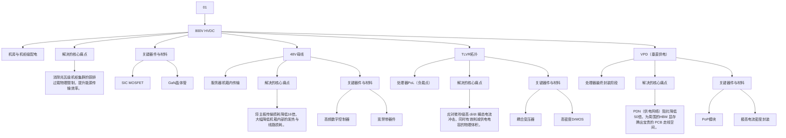

# 260426 - 功率器件：AI 基础设施中被市场定价遗忘的一环

# 要点

1. AI服务器功耗量级跃迁带来的物理约束与供电架构重构；  
2. 功率器件寡头供给格局及 8 英寸 BCD 产能制造瓶颈；  
3. 价格滞后的结构性原因与认证锁定效应；  
4. 与HBM叙事的类比及关键差异；  
5. 国产替代路径与投资含义。

# 专家观点

> TL;DR：AI服务器功率器件——MOSFET、DrMOS、多相电源控制器——正在成为整个AI供应链中被系统性低估的第二大瓶颈。供需矛盾已清晰可辨：寡头供给格局较HBM更为集中、8英寸BCD工艺扩产的物理限制短期无解、国产替代在认证壁垒与工艺差距面前进展迟缓。然而，价格涨幅远未反映这一现实，市场叙事几乎被存储主题完全遮蔽。这种定价脱节，本质上是一个观察时间差：HBM 的价格发现发生在2024年，功率器件的定价重估才刚刚开始。

# 功耗量级跃迁：AI服务器的物理约束

# 1.1 从TDP到机柜级功率密度

AI服务器的功耗演变，不是线性增长，而是量级跃迁。传统云计算时代，标准CPU的TDP（热设计功耗）通常在200W左右，标准VRM即可应付。进入生成式AI时代，NVIDIA H100的TDP飙升至700W，Blackwell B200 更突破 1000W 大关。下一代 Vera Rubin 平台的 TDP 预计将落在 1,200W 至1,500W 区间。

bar

| 类别 | TDP (W) |
|---|---|
| 传统CPU | 200 |
| H100 Hopper | 700 |
| B200 Blackwell | 1,000 |
| Vera Rubin(预计) | 1,400 |

机柜层面的变化同样剧烈。传统机柜功率密度通常在10至15kW，现代AI机柜已突破100kW—NVIDIA GB200 NVL72 单柜 TDP 约 125 至 130kW，机架行乃至集群级配电目标已瞄准 MW 级别。AI 服务器单机功率密度较传统服务器高出3至5倍，单颗处理器的负载电流在未来十年预计将升至10,000安培，是当前水平的10倍。

问题的物理本质在于"最后一英寸"。在 0.8V 核心电压下提供 1,000W 功率，意味着需要持续输送高达1,250A的电流。这股电流穿越PCB铜箔走线时，哪怕只有微欧姆级别的寄生电阻，也会产生指数级放大的热耗散与电压跌落——供电电压一旦在AI计算峰值时跌破容差下限，哪怕只是几十毫伏，整个加速卡的计算结果就会出错乃至崩溃。这就是整个功率器件需求爆发的物理起点。

除绝对功耗外，AI任务的瞬态特性同样苛刻。训练阶段，电源系统承受持续高强度热应力；推理阶段，用户请求随机、token生成规模不确定，负载会在微秒内从接近空闲瞬跳至满载。这种极高的di/dt（电流变化率）对多相电源系统的瞬态响应能力提出了近乎严苛的要求，传统通用服务器的VRM设计根本无法胜任。

# 1.2 架构重构：从 12V 到 48V，再到 800V HVDC

功耗暴涨正在倒逼整个电源架构体系推倒重来。现代AI数据中心的电力输送网络，正经历一场从宏观配电到微观封装的全链路变革。

机柜层面，传统12V或54V直流配电已触及物理上限。若在1MW的AI机柜集群中沿用54V母线，仅铜排母线就需约200公斤，物理空间将被完全占用。为解决这一"铜过载"困局，800V HVDC配电架构正在成为下一代标准，这一转型直接带动了SiC MOSFET的大规模应用——SiC 3.26 eV的禁带宽度能够承受高压、高频和极端热载，传统硅材料无法达到这一要求。

进入服务器机箱内部，母线已从12V全面向48V迁移：电压提升4倍，传输电流缩至四分之一，线路损耗降低16倍。这是AI数据中心电源架构演进中结构性需求增量最为显著的拐点。从48V到芯片核心0.8V的"最后一英寸"降压，则依赖TLVR（跨感压调节器）拓扑和DrMOS（驱动+MOSFET集成模块）这类高度集成的功率器件。

更前沿的方向是VPD（垂直供电技术）：将末级电源转换模块直接移至处理器封装底部，电流从底部垂直穿基板直送芯片。这种极短的三维路径可将PDN阻抗降低50倍以上，同时将处理器顶层PCB空间完全释放出来，为HBM和高速I/O互连让路。VPD不仅是电源效率优化，更是解锁下一代AI算力上限的结构性先决条件。

flowchart

# 二、寡头供给格局：比HBM更集中的定价结构

# 2.1 三巨头垄断与护城河

全球高端多相电源控制器和DrMOS市场，实质上只有三家公司构成有效竞争：英飞凌（Infineon）、瑞萨电子（Renesas）和芯源系统（MPS）。这一寡头格局的集中程度，甚至超过了备受关注的HBM存储赛道（SK海力士、三星、美光三足鼎立）。

调研显示，AI服务器功率管理IC（PMIC）的全球TAM预计从2024年的约60亿美元增长至2027年的逾120亿美元；三巨头合计占据超过70%的份额，意味着超过80亿美元的增量市场基本由三家分食，局外人几乎无从置喙。

bar

| Company | Percentage (%) |
|---|---|
| 英飞凌 (Infineon) | 35 |
| 芯源系统 (MPS) | 32 |
| 瑞萨 (Renesas) | 25 |
| AOS等其他 | 8 |

# 英飞凌 (Infineon)

#

# 芯源系统(MPS)

#

#

#

这种格局的形成，依托的是数十年积累的模拟与混合信号设计护城河——英飞凌的BCD（双极-CMOS-DMOS）工艺、MPS 的 DrMOS 翻转芯片（Flip Chip）封装技术、瑞萨的数字多相控制器算法，每一项都具备高度不可复制性。NVIDIA等大客户通常同时维持2至3家供应商并行，以防单点风险；但这一策略本身也意味着，这三家以外的竞争者几乎没有切入窗口。

在 Blackwell/GB200 平台的电源功率级上，MPS 当前估计占据约 80%至 90%的份额，并预计在 VeraRubin一代保持类似水平。披露显示MPS FY2025全年营收约28亿美元，同比增长26.4%，毛利率长期维持在55%至58%区间，AI算力驱动的结构性增长已在财务数据中得到印证。

# 2.2 制造瓶颈：8英寸BCD产能的硬约束

市场低估功率器件的一个常见误区，是认为这类器件"产能没有问题"。实际情况恰好相反。

AI服务器PMIC的核心制造工艺是8英寸晶圆上的BCD复合工艺——这不是标准逻辑工艺，全球具备高质量BCD产能的晶圆厂屈指可数。雪上加霜的是，三星正在关闭其韩国S5厂的8英寸晶圆产线，直接压缩了本已紧张的全球供给。

扩产速度无法跟上需求节奏。英飞凌在2025年将年度资本开支计划从22亿欧元上调至27亿欧元，新增5亿欧元专项用于AI数据中心电源芯片产能扩充。然而，从宣布扩产到新产能形成规模量产，通常需要2至3年的建设与爬坡周期——这与HBM扩产的时间节奏几乎完全一致，缺口的持续时间可能超出市场预期。

# 三、价格错配：定价权已形成，重估尚未到来

# 3.1 价格滞后的结构性原因

2025年至2026年初，当DRAM和HBM合同价格累计涨幅已超过50%、并持续向更高区间进发时，AI服务器功率器件的定价拐点才真正到来。2026年2月，英飞凌向客户正式发函，宣布自4月1日起上调功率开关及相关IC价格，明确指出AI数据中心的快速扩张已导致部分产品持续供应偏紧；与此同步，国内华润微、捷捷微电、NCE 等厂商亦在 2026 年 2 至 3 月密集发出涨价通知，MOSFET 产品普遍提价10%至20%，个别品类涨幅达40%至80%。这一轮价格调整的底层逻辑已与早期成本传导截然不同AI需求挤压8英寸产能、部分海外产线向先进封装转型导致成熟制程供给主动收缩，供应商的定价权属性正在从"被动吸收成本"切换为"主动稀缺溢价"。尽管如此，相较于存储赛道的涨幅，功率器件迄今10%至 20%的价格调整仍处于补涨行情的早期阶段，与供需缺口的真实规模之间依然存在显著落差。

这种价格滞后有其结构性原因：功率器件的定价机制更依赖长期框架协议（LTA），而非存储那样的现货市场逻辑。LTA在短期内平滑了价格发现，但一旦认证锁定完成，供应商就握有显著的定价权—转换成本极高，买方对价格涨价的抵抗力大为受限。

英飞凌在涨价函中明确表示，已将核心8英寸BCD产能向AI赛道倾斜，"间接导致光伏、储能、传统汽车等领域同类产品供给被动收缩"。这一表述的战略含义清晰：供应优先级的重排，是涨价周期启动的先行信号，而非价格已经充分定价。

# 3.2 认证锁定与替换成本

AI服务器平台认证周期通常需要15至24个月，超大规模CSP对新供应商的导入极为保守，需要海量实际运行数据支撑。这赋予了英飞凌、MPS、瑞萨类似HBM中"锁定供应商"的逻辑——已通过认证的供应商，在平台生命周期内具备近乎刚性的定价权。PMIC 交期延至 25 至 35 周的趋势，正在接近DRAM同期52至56周的水平，紧缺程度与存储赛道的收敛将是触发重新定价的关键节点。

# 四、HBM 叙事类比：相似底色，关键差异

将功率器件赛道与HBM存储赛道并排审视，两者之间的结构相似度远超市场感知，这也是为什么前者具备从"存储第二"视角研究的价值。

text_image

ResearchD 笃
功率器件与HBM存储
赛道类比
HBM/DRAM 内存 VS AI服务器功率器件 (MOSFET、
PMIC)
三星、SK海力士、美光寡占 市场集中度 英飞凌、瑞萨、MPS垄断；集中度更高
先进HBM工艺，2—3年建厂周期 扩产难度 8英寸BCD工艺，产能受三星S5厂关闭压缩；
同样2—3年
已大幅上涨，单季度峰值80—90% 价格涨幅 涨价刚启动，10—20%，明显滞后于供需缺口
投资主题核心叙事 市场关注度 几乎被当前叙事完全忽视，典型非共识
充分体现紧缺；HBM LT延至38—42周 交货期(LT) PMIC LT延至25—35周，仍在恶化中
长鑫存储已量产DDR5，HBM仍处研发阶段 国产替代进展 处于量产前期，2027年前难成气候
现货市场 + 框架协议双轮驱动 定价权来源 平台认证锁定定价权，转换成本极高
资料来源：笔者整理及评估。

两者最关键的差异在于叙事进度：HBM的价格发现已经完成，涨价预期充分反映在股价中；功率器件的定价重估才刚刚开始，市场关注度与基本面之间的落差，正是这条赛道非共识价值的来源。

# 五、国产替代：路径可期，窗口有限

在 GPU、光模块、交换机 ASIC 等领域，国内厂商替代的叙事推进迅速。但在 AI 服务器功率器件赛道，国产替代的实质进展比市场预期慢得多。卡脖子的不是技术路线，而是三重结构性壁垒，且相互强化：

● 认证壁垒：AI服务器平台认证周期15至24个月，CSP对新供应商导入极为保守，现有实际运行数据积累远不足以支撑规模导入。  
● 工艺差距：先进DrMOS产品依赖精密BCD混合工艺，国内现有8英寸产线的工艺节点落后英飞凌、瑞萨约1至2代。  
● SiC/GaN差距更为突出：中国SiC厂商要在质量和产能上追上西方供应商，保守估计至少还需4至5年；中国电动车厂商自身对西方SiC供应的依赖，在未来5至6年内亦难以根本改变。

这种困境本质上是一个"鸡生蛋、蛋生鸡"的结构：没有大订单就无法积累足够的实际运行数据，没有数据就无法通过认证获得大订单。国产替代在 AI 服务器功率器件领域形成实质性规模供给，最快要到2027至2028年。这意味着外资三巨头的主导地位，在可预见的投资窗口期内不存在实质威胁。

# 六、投资含义

功率器件赛道当前具备三个相互强化的驱动力：供给侧硬约束（BCD产能因三星退出而收缩）、需求侧加速（TrendForce估计2025年全球AI服务器出货量实际同比增长约24%，2026年预计进一步加速至28%以上）、以及定价权回归（认证壁垒确立的不可替代性）。三力叠加的时机，通常是定价拐点到来的前兆。

在产品维度，多相电源控制器（PWM Controller）和高性能DrMOS模块是价值最集中的产品线。英飞凌 PSS（电源与传感方案）业务的 AI 电源部门、MPS 的 Enterprise Data 部门、以及瑞萨 Analog &Power部门，是追踪季度营收节奏与交期变化的重点观察对象。

以下风险不可忽视：

● 需求节奏风险：若AI资本开支出现阶段性放缓（如云厂商主动消化库存），功率器件需求亦将随之回落——2025 年底 GB200 曾出现短暂的交付窗口期延迟，类似情形存在再现可能。

● Co-Packaged Power（CPP）技术路径风险：若AI加速器向"电源芯片与处理器深度共封装"方向加速演进，当前外置功率模块的市场地位可能面临结构性稀释。据Intel、TSMC及三星在OIF及IEDM披露的功率封装路线图，CPP技术的量产节点预计在2028年前后，这意味着外置功率器件的窗口期约有2至3年的相对确定性，但投资者须在2027至2028年前后密切关注路线图进展。

● 国产替代提速风险：若中国政策大力推动AI服务器供应链全面国产化，并提供验证周期加速机制，士兰微等企业有可能在政策背书下提前进入认证流程。

市场的注意力是稀缺资源。当HBM涨价与CoWoS产能成为主流叙事的焦点，功率器件这条赛道反而得以在定价层面保持"安静"——然而一旦某个季度的交期数据突然出现在供应商业绩发布会上，就可能触发集体重新定价。

以上内容不构成任何投资建议，请风险自担。