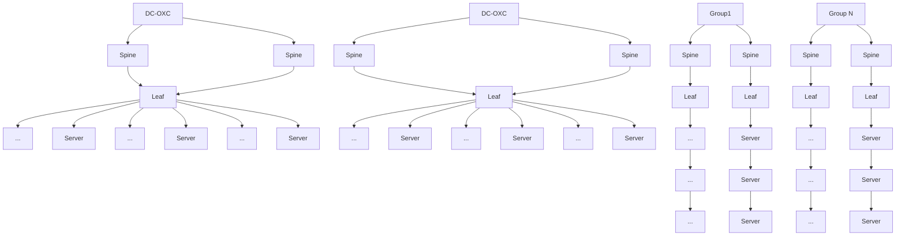

# They took OCS further with Optical Cross Connect (

URL

https://x.com/zephyr\_z9/status/2048138817673306157

# Content

They took OCS further with Optical Cross Connect (OXC) https://t.co/HJAbXMEQrj

[Quoted: https://x.com/bronzeagepapi/status/2048124507248877913].@Huawei TPUs and Optical Circuit Switching https://t.co/9PlXcGDiog

[Thread continued]Looks like Jeff Pu is on Twitter nowOne of the best in the game

OXC systems are built around several key components:

flowchart

Optical backplane architecture diagram showing connections between optical circuit board, CD optical branch board, and all-optical backplane with labeled components and wiring paths.

AFigure from Huawei

·OpticalCrossConnectMatrix:TheheartoftheOCthismatrixalowsanynternalportstinterconnecteablingfleible signalroutingacrossmultiplepaths.   
·OpticalCircuit Boards:Theseboardshandleincomingopticalsignals，breakingthemdownintomultiplewavelengthsignals usingaWavelegtheectivechrlteoieelditrchateic hadreliabilitsssdesemsseLiqdrtanlionoStechyingereblitytfr variablechannelwidths,and lowerpowerconsumption.   
OpticalBackplane:AdistinguishingfeatureofOXCcomparedtoROADMstheoticalbackplanereplacesthetraditionalinternal icctticse allowingfornon-blockingsignalrouting.   
OpticalTributaryBoards:Afterpassingthroughtheopticalbackplanesignalsarefurtherprocessedbyopticaltributaryboards Thesediteei andperformance.

# 2.3OCS在AI集群参数面的革命性应用

华为在2024全联接大会上发布的数据中心全光交换机，将全光交叉技术引入数据中心内部，用光交换机替代顶层电交换机，打造了面向AI的新一代光电融合智算数据中心架构。

flowchart

这种架构带来了四大核心价值：

1.大规模弹性组网：支持按POD粒度分期建设，算力资源按需灵活组网  
2.平滑演进：协议无感知，支持向800G、1.6T甚至更高速率演进  
3.绿色节能：设备功耗百瓦级，网络功耗相比三层胖树降低20%   
4高可靠性：省去一层光模块焦群故陪率降低15%V上

# The Need for OXC

OXCemergedassolutiontoaddressthelimitationsofReconfigurableOpticalAdd-DropMultiplexers(OADMs).WhileOMsallow fordynamicwavelengthroutingwithinopticalnetworks,theyhaveinherentcomplexities,especiallyinfiberconections.

```mermaid
graph TD
    subgraph Add/Drop Bank 1
        A1["WSS"] -->|TX| B1["Add/Drop Bank 1"]
        A2["WSS"] -->|TX| B2["Add/Drop Bank 1"]
        A3["WSS"] -->|TX| B3["Add/Drop Bank 1"]
        A4["WSS"] -->|TX| B4["Add/Drop Bank 1"]
        A5["WSS"] -->|TX| B5["Add/Drop Bank 1"]
        A6["WSS"] -->|TX| B6["Add/Drop Bank 1"]
        A7["WSS"] -->|TX| B7["Add/Drop Bank 1"]
        A8["WSS"] -->|TX| B8["Add/Drop Bank 1"]
        A9["WSS"] -->|TX| B9["Add/Drop Bank 1"]
        A10["WSS"] -->|TX| B10["Add/Drop Bank 1"]
        A11["WSS"] -->|TX| B11["Add/Drop Bank 1"]
        A12["WSS"] -->|TX| B12["Add/Drop Bank 1"]
        A13["WSS"] -->|TX| B13["Add/Drop Bank 1"]
        A14["WSS"] -->|TX| B14["Add/Drop Bank 1"]
        A15["WSS"] -->|TX| B15["Add/Drop Bank 1"]
        A16["WSS"] -->|TX| B16["Add/Drop Bank 1"]
        A17["WSS"] -->|TX| B17["Add/Drop Bank 1"]
        A18["WSS"] -->|TX| B18["Add/Drop Bank 1"]
        A19["WSS"] -->|TX| B19["Add/Drop Bank 1"]
        A20["WSS"] -->|TX| B20["Add/Drop Bank 1"]
        A21["WSS"] -->|TX| B21["Add/Drop Bank 1"]
        A22["WSS"] -->|TX| B22["Add/Drop Bank 1"]
        A23["WSS"] -->|TX| B23["Add/Drop Bank 1"]
        A24["WSS"] -->|TX| B24["Add/Drop Bank 1"]
        A25["WSS"] -->|TX| B25["Add/Drop Bank 1"]
        A26["WSS"] -->|TX| B26["Add/Drop Bank 1"]
        A27["WSS"] -->|TX| B27["Add/Drop Bank 1"]
        A28["WSS"] -->|TX| B28["Add/Drop Bank 1"]
        A29["WSS"] -->|TX| B29["Add/Drop Bank 1"]
        A30["WSS"] -->|TX| B30["Add/Drop Bank 1"]
        A31["WSS"] -->|TX| B31["Add/Drop Bank 1"]
        A32["WSS"] -->|TX| B32["Add/Drop Bank 1"]
        A33["WSS"] -->|TX| B33["Add/Drop Bank 1"]
        A34["WSS"] -->|TX| B34["Add/Drop Bank 1"]
        A35["WSS"] -->|TX| B35["Add/Drop Bank 1"]
        A36["WSS"] -->|TX| B36["Add/Drop Bank 1"]
        A37["WSS"] -->|TX| B37["Add/Drop Bank 1"]
        A38["WSS"] -->|TX| B38["Add/Drop Bank 1"]
        A39["WSS"] -->|TX| B39["Add/Drop Bank 1"]
        A40["WSS"] -->|TX| B40["Add/Drop Bank 1"]
        A41["WSS"] -->|TX| B41["Add/Drop Bank 1"]
        A42["WSS"] -->|TX| B42["Add/Drop Bank 1"]
        A43["WSS"] -->|TX| B43["Add/Drop Bank 1"]
        A44["WSS"] -->|TX| B44["Add/Drop Bank 1"]
        A45["WSS"] -->|TX| B45["Add/Drop Bank 1"]
        A46["WSS"] -->|TX| B46["Add/Drop Bank 1"]
        A47["WSS"] -->|TX| B47["Add/Drop Bank 1"]
        A48["WSS"] -->|TX| B48["Add/Drop Bank 1"]
        A49["WSS"] -->|TX| B49["Add/Drop Bank 1"]
        A50["WSS"] -->|TX| B50["Add/Drop Bank 1"]
        A51["WSS"] -->|TX| B51["Add/Drop Bank 1"]
        A52["WSS"] -->|TX| B52["Add/Drop Bank 1"]
        A53["WSS"] -->|TX| B53["Add/Drop Bank 1"]
        A54["WSS"] -->|TX| B54["Add/Drop Bank 1"]
        A55["WSS"] -->|TX| B55["Add/Drop Bank 1"]
        A56["WSS"] -->|TX| B56["Add/Drop Bank 1"]
        A57["WSS"] -->|TX| B57["Add/Drop Bank 1"]
        A58["WSS"] -->|TX| B58["Add/Drop Bank 1"]
        A59["WSS"] -->|TX| B59["Add/Drop Bank 1"]
        A60["WSS"] -->|TX| B60["Add/Drop Bank 1"]
        A61["WSS"] -->|TX| B61["Add/Drop Bank 1"]
        A62["WSS"] -->|TX| B62["Add/Drop Bank 1"]
        A63["WSS"] -->|TX| B63["Add/Drop Bank 1"]
        A64["WSS"] -->|TX| B64["Add/Drop Bank 1"]
        A65["WSS"] -->|TX| B65["Add/Drop Bank 1"]
        A66["WSS"] -->|TX| B66["Add/Drop Bank 1"]
        A67["WSS"] -->|TX| B67["Add/Drop Bank 1"]
        A68["WSS"] -->|TX| B68["Add/Drop Bank 1"]
        A69["WSS"] -->|TX| B69["Add/Drop Bank 1"]
        A70["WSS"] -->|TX| B70["Add/Drop Bank 1"]
        A71["WSS"] -->|TX| B71["Add/Drop Bank 1"]
        A72["WSS"] -->|TX| B72["Add/Drop Bank 1"]
        A73["WSS"] -->|TX| B73["Add/Drop Bank 1"]
        A74["WSS"] -->|TX| B74["Add/Drop Bank 1"]
        A75["WSS"] -->|TX| B75["Add/Drop Bank 1"]
        A76["WSS"] -->|TX| B76["Add/Drop Bank 1"]
        A77["WSS"] -->|TX| B77["Add/Drop Bank 1"]
        A78["WSS"] -->|TX| B78["Add/Drop Bank 1"]
        A79["WSS"] -->|TX| B79["Add/Drop Bank 1"]
        A80["WSS"] -->|TX| B80["Add/Drop Bank 1"]
        A81["WSS"] -->|TX| B81["Add/Drop Bank 1"]
        A82["WSS"] -->|TX| B82["Add/Drop Bank 1"]
        A83["WSS"] -->|TX| B83["Add/Drop Bank 1"]
        A84["WSS"] -->|TX| B84["Add/Drop Bank 1"]
        A85["WSS"] -->|TX| B85["Add/Drop Bank 1"]
        A86["WSS"] -->|TX| B86["Add/Drop Bank 1"]
        A87["WSS"] -->|TX| B87["Add/Drop Bank 1"]
        A88["WSS"] -->|TX| B88["Add/Drop Bank 1"]
        A89["WSS"] -->|TX| B89["Add/Drop Bank 1"]
        A90["WSS"] -->|TX| B90["Add/Drop Bank 1"]
        A91["WSS"] -->|TX| B91["Add/Drop Bank 1"]
        A92["WSS"] -->|TX| B92["Add/Drop Bank 1"]
        A93["WSS"] -->|TX| B93["Add/Drop Bank 1"]
        A94["WSS"] -->|TX| B94["Add/Drop Bank 1"]
        A95["WSS"] -->|TX| B95["Add/Drop Bank 1"]
        A96["WSS"] -->|TX| B96["Add/Drop Bank 1"]
        A97["WSS"] -->|TX| B97["Add/Drop Bank 1"]
        A98["WSS"] -->|TX| B98["Add/Drop Bank 1"]
        A99["WSS"] -->|TX| B99["Add/Drop Bank 1"]
        A100["WSS"] -->|TX| B100["Add/Drop Bank 1"]
    end
    subgraph Add/Drop Bank 2
        B1 -->|TX| A1
        B2 -->|TX| A2
        B3 -->|TX| A3
        B4 -->|TX| A4
        B5 -->|TX| A5
        B6 -->|TX| A6
        B7 -->|TX| A7
        B8 -->|TX| A8
        B9 -->|TX| A9
        B10 -->|TX| A10
        B11 -->|TX| A11
        B12 -->|TX| A12
        B13 -->|TX| A13
        B14 -->|TX| A14
        B15 -->|TX| A15
        B16 -->|TX| A16
        B17 -->|TX| A17
        B18 -->|TX| A18
        B19 -->|TX| A19
        B20 -->|TX| A20
        B21 -->|TX| A21
        B22 -->|TX| A22
        B23 -->|TX| A23
        B24 -->|TX| A24
        B25 -->|TX| A25
        B26 -->|TX| A26
        B27 -->|TX| A27
        B28 -->|TX| A28
        B29 -->|TX| A29
        B30 -->|TX| A30
        B31 -->|TX| A31
        B32 -->|TX| A32
        B33 -->|TX| A33
        B34 -->|TX| A34
        B35 -->|TX| A35
        B36 -->|TX| A36
        B37 -->|TX| A37
        B38 -->|TX| A38
        B39 -->|TX| A39
        B40 -->|TX| A40
        B41 -->|TX| A41
        B42 -->|TX| A42
        B43 -->|TX| A43
        B44 -->|TX| A44
        B45 -->|TX| A45
        B46 -->|TX| A46
        B47 -->|TX| A47
        B48 -->|TX| A48
        B49 -->|TX| A49
        B50 -->|TX| A50
        B51 -->|TX| A51
        B52 -->|TX| A52
        B53 -->|TX| A53
        B54 -->|TX| A54
        B55 -->|TX| A55
        B56 -->|TX| A56
        B57 -->|TX| A57
        B58 -->|TX| A58
        B59 -->|TX| A59
        B60 -->|TX| A60
        B61 -->|TX| A61
        B62 -->|TX| A62
        B63 -->|TX| A63
        B64 -->|TX| A64
        B65 -->|TX| A65
        B66 -->|TX| A66
        B67 -->|TX| A67
        B68 -->|TX| A68
        B69 -->|TX| A69
        B70 -->|TX| A70
        B71 -->|TX| A71
        B72 -->|TX| A72
        B73 -->|TX| A73
        B74 -->|TX| A74
        B75 -->|TX| A75
        B76 -->|TX| A76
        B77 -->|TX| A77
        B78 -->|TX| A78
        B79 -->|TX| A79
        B80 -->|TX| A80
        B81 -->|TX| A81
        B82 -->|TX| A82
        B83 -->|TX| A83
        B84 -->|TX| A84
        B85 -->|TX| A85
        B86 -->|TX| A86
        B87 -->|TX| A87
        B88 -->|TX| A88
        B89 -->|TX| A89
        B90 -->|TX| A90
        B91 -->|TX| A91
        B92 -->|TX| A92
        B93 -->|TX| A93
        B94 -->|TX| A94
        B95 -->|TX| A95
        B96 -->|TX| A96
        B97 -->|TX| A97
        B98 -->|TX| A98
        B99 -->|TX| A99
        B100 -->|TX| A100
    end
    subgraph Add/Drop Bank 2
        A1 -->|TX| B1
        A2 -->|TX| B2
        A3 -->|TX| B3
        A4 -->|TX| B4
        A5 -->|TX| B5
        A6 -->|TX| B6
        A7 -->|TX| B7
        A8 -->|TX| B8
        A9 -->|TX| B9
        A10 -->|TX| B10
        A11 -->|TX| B11
        A12 -->|TX| B12
        A13 -->|TX| B13
        A14 -->|TX| B14
        A15 -->|TX| B15
        A16 -->|TX| B16
        A17 -->|TX| B17
        A18 -->|TX| B18
        A19 -->|TX| B19
        A20 -->|TX| B20
        A21 -->|TX| B21
        A22 -->|TX| B22
        A23 -->|TX| B23
        A24 -->|TX| B24
        A25 -->|TX| B25
        A26 -->|TX| B26
        A27 -->|TX| B27
        A28 -->|TX| B28
        A29 -->|TX| B29
        A30 -->|TX| B30
        A31 -->|TX| B31
        A32 -->|TX| B32
        A33 -->|TX| B33
        A34 -->|TX| B34
        A35 -->|TX| B35
        A36 -->|TX| B36
        A37 -->|TX| B37
        A38 -->|TX| B38
        A39 -->|TX| B39
        A40 -->|TX| B40
        A41 -->|TX| B41
        A42 -->|TX| B42
        A43 -->|TX| B43
        A44 -->|TX| B44
        A45 -->|TX| B45
        A46 -->|TX| B46
        A47 -->|TX| B47
        A48 -->|TX| B48
        A49 -->|TX| B49
        A50 -->|TX| B50
        A51 -->|TX| B51
        A52 -->|TX| B52
        A53 -->|TX| B53
        A54 -->|TX| B54
        A55 -->|TX| B55
        A56 -->|TX| B56
        A57 -->|TX| B57
        A58 -->|TX| B58
        A59 -->|TX| B59
        A60 -->|TX| B60
        A61 -->|TX| B61
        A62 -->|TX| B62
        A63 -->|TX| B63
        A64 -->|TX| B64
        A65 -->|TX| B65
        A66 -->|TX| B66
        A67 -->|TX| B67
        A68 -->|TX| B68
        A69 -->|TX| B69
        A70 -->|TX| B70
        A71 -->|TX| B71
        A72 -->|TX| B72
        A73 -->|TX| B73
        A74 -->|TX| B74
        A75 -->|TX| B75
        A76 -->|TX| B76
        A77 -->|TX| B77
        A78 -->|TX| B78
        A79 -->|TX| B79
        A80 -->|TX| B80
        A81 -->|TX| B81
        A82 -->|TX| B82
        A83 -->|TX| B83
        A84 -->|TX| B84
        A85 -->|TX| B85
        A86 -->|TX| B86
        A87 -->|TX| B87
        A88 -->|TX| B88
        A89 -->|TX| B89
        A90 -->|TX| B90
        A91 -->|TX| B91
        A92 -->|TX| B92
        A93 -->|TX| B93
        A94 -->|TX| B94
        A95 -->|TX| B95
        A96 -->|TX| B96
        A97 -->|TX| B97
        A98 -->|TX| B98
        A99 -->|TX| B99
        A100 -->|TX| B100
    end
```

flowchart

Asnetworksexpandandrequireadjustments,managingtheseconnectionscanbecomeumbersome,leadingtohaoticfiberlayouts increasedspacerequirements,andcomplexmaintenance.OXCsolvestheseisuesbyprovidingamorescalableandreliableoptical switchingplatform.

text_image

数据中心全光交换机
Huawei OptiXtrans DC808

EguityResearch

# Intel (INTc Us)

# EarningsBeat,FromRecoverytoStrength

Raise TP to \$94.2:Despite raised expectations,the results were much better than expected, despite conservatismonF2Qguidance.Many viewthecallasmateriallyconstructivethana typical Intel update. Indeed, there were brokers’upgrade to catch up, as the thesis is shifting from"turnaround survivalto “Al beneficiary+external foundry optionality,In general,we believe Intel's bread and butter CPU businesswillcontinue to be strong,while the key to watch is the supply tightness from substrate and Si-cap,and the foundry wins & execution hasbeen tracking ahead per our consistent report updates.By factoringresults,guidance and highermargins,we revise 2026E/2027E/2028E EPSto \$1.5/\$2.4/\$3.1,andliftedTPfrom \$78.5 to \$94.2, now based on 3.5x 2027E BVPS or 39x/30x 2027E/2028E EPS.

Earnings beat on all fronts:F1Q revenue came inat S13.6bn,or \$1.4bn above guidance midpointandabove consensusof S12.4bn.Non-GAAP grossmarginwas41%,above guidance and consensus of 35%,while EPS was\$0.29 vs.guidance of breakeven.Operating cash flow was \$1.1bn,with adjusted FCF of -\$2bn.For F2Q，it guided sales to be \$13.8bn \$14.8bn,or2%-9%QoQ or consensus of \$13bnandnon-GAAP grossmarginof 39%to reflect the highermix of Pather Lake.It expects EPS of \$0.20 and double digits QoQ for DCAl.

Foundry on the right track:As said many times since our Intel lnitiation on July 23 2025 andour Intelpreview onApril16.wecontinuetoexpect strongcustomer engagementssuch asApple,Nvidia,AMD, etc,for18A-P(mainly 14A)andbelievethat it to win TeslaAl6 variant based onits 14Ainlate-2028.Execution wise，mgmt.indicates18Avields areaheadof internal projections.External foundryrevenue was stillsmallat\$174m,withoperating lossof \$2.4bn, improvingsby S72mn QoQ.Mgmt.nxpects tossesto improvethrough the year.

CPU from strength to strength: Intel believes that Al workloads are shifting from training toward inference,agenticAl,robotics,physicalAl,andedgeAl,makingCPUsmore important astheorchestrationlayerof theAl stack.Mgmt.suggeststheserverCPUdemand improved meaningfully over the past 90 daysand expects double-digit unit growth for both the industry and Intel in 2026,with momentum extending into 2027.As said in our Intel preview report on April 16t，the raise of CPU prices in 2Q26 is wellexpected,and weexpect another round of +5-10%in late-3Q26.We now expect itsDCAl tobe+39%YoY/+15%YoYin2026E/2027E.

Risks:1)Al 

<table><tr><td colspan="6">Profit forecast</td></tr><tr><td></td><td>2024</td><td>2025</td><td>2026E</td><td>2027E</td><td>2028E</td></tr><tr><td>Revenue (m)</td><td>53,101</td><td>52,853</td><td>63,180</td><td>73,607</td><td>83,822</td></tr><tr><td>Revenue YoY (%)</td><td>-2.1</td><td>-0.5</td><td>19.5</td><td>16.5</td><td>13.9</td></tr><tr><td>Net profit (m)</td><td>-566</td><td>1,929</td><td>7,409</td><td>12,168</td><td>15,878</td></tr><tr><td>Net profit YoY (%)</td><td>N.A.</td><td>N.A.</td><td>284.1</td><td>64.2</td><td>30.5</td></tr><tr><td>EPS ($)</td><td>-0.1</td><td>0.4</td><td>1.5</td><td>2.4</td><td>3.1</td></tr><tr><td>P/E</td><td>-505.0</td><td>-60.6</td><td>45.8</td><td>27.9</td><td>21.4</td></tr><tr><td>ROE (%)</td><td>N.A.</td><td>1.7</td><td>5.9</td><td>1.9</td><td>10.4</td></tr></table>

refudhy

Jeff Pu,CFA

EvanLee

SFC CE No.BV529