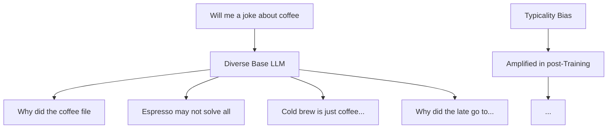

# Every time AI got better at being helpful, it got

URL

https://x.com/VaibhavSisinty/status/2048397709321859518

# Content

Every time AI got "better" at being helpful, it got worse at being smart.

Stanford just published why.

every time you ask Claude, ChatGPT, or Gemini a question, the AI calculates dozens of possible answers in its head.

some are brilliant. some are weird. some are genuinely creative.

it shows you the most boring one. on purpose.

here's why.

→ AI companies train their models using human reviewers.   
→ reviewers are shown 2 answers and asked to pick the better one.   
→ humans naturally pick the safer, more familiar, more predictable answer every time.   
→ over millions of these choices, the model learns to never take creative risks.

the AI didn't lose its creativity. it just learned to hide it.

and here's the part that should make you angry as a paying user.

the more advanced the model, the worse this gets. GPT 4. Claude Opus. Gemini Ultra.

the most expensive AI you can buy is also the one with the most creativity buried inside it.

now the part Stanford actually published.

they found a single prompt that unlocks it. instead of asking the AI for one answer, you ask it for 5 answers along with the probability of each. the safety filter breaks.

the model is forced to reveal the weird, surprising, creative answers it normally suppresses.

results. 2x more creativity. across every major model. zero loss in accuracy.

you've been paying for the genius.

they've been giving you the assistant.

# VERBALIZEDSAMPLING:HOWTOMITIGATEMODE COLLAPSEANDUNLOCKLLMDIVERSITY

<table><tr><td>Jiayi Zhang-1, Simon Yu-1, Derek Chong-2, Anthony Sicilia3
Michael R. Tomz2, Christopher D. Manning2, Weiyan Shi1
Northeastern University1 Stanford University2 West Virginia University3
{zhang.jiayi12, yu.chi, we.shi}@northeastern.edu
{derekch, tomz, manning}@stanford.edu, anthony.sicilia@mail.wvu.edu
Website Blog Code</td></tr></table>

ABSTRACT

Post-training alignment often reduces LLM diversity.leading to a phenomenon knottraininodalcollapnt.UnlikedriorwOrkthatatributesthisgftecttoalgorithmin limitations,weidentifyafundamental,pervasivedata-leveldriver:typicalitybias inpreferencedata,wherebyamnotatoserystematicallyfavrfamiliartextaida insultfofewell-dstablishedfindinnstinorognitiveatiyahology. Weformalizethis biastheoretically,verifyitonpreferencedatasetsempirically,and showthatit playsacentral roleinmodecollapse.Motivatedby thisanalysis,we introduce VerbalizedSamplin(s)aesimple,training-freedomptingntrategytocincumvent modecollapse.VSpromptsthemodeltoverbalizeaprobabilitydistributionover asetofresponses(e.g., "Generate5jokesaboutcoffeeandtheircorresponding probabilitieso).ComprehensiveraxperimentashowthatVSsignificantlyimondveg performanceacrosscreativewriting(poems,stories,jokes),dialogue simulation, open-endedQA,and syntheticdatageneration,without sacrificingfactual accuracy andsafety.Forinstance,increativewriting,VSincreasesdiversityby1.6-2.1× avdrdirectprormpting.Wefurtherobserveanemergenttrendthatmorecapable modelsbenpritporefromVs.Insusmrveurrworkgrovidesdatnawdata-cpntric perspective onmode collapseand apractical inference-time remedy that helps pnlocknre-trainedgeneratiyediversity

flowchart

text_image

Decision for generating 5 jokes of coffee, with options to show different types of coffee and a longer time to get fun.

Figure1:Weshowthat typicality biasinpreferencedataisafundamental and pervasive causeof modecollapss,reducinutcputdiveasity.Pefereolution,weropdseVerbalizedSamplin(VS) prineipledpromptingingthodthatreturnsdistributionsonfrespprops,toimpalvedrsity.